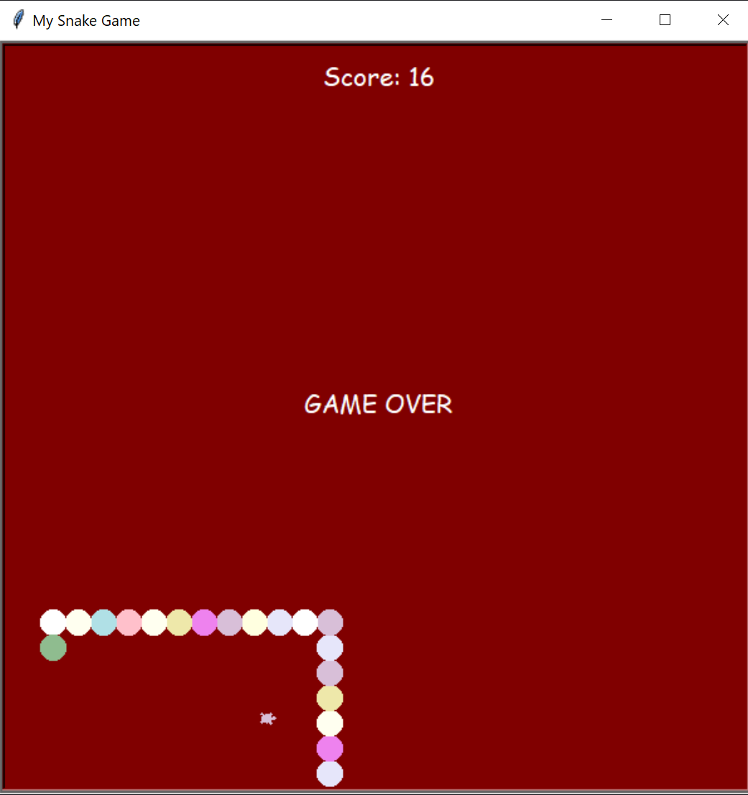

# snake-game
A simple snake game in Python using turtle library.

The game was created by the following 7 steps:
1. Create a snake body
2. Move the snake
3. Create snake food
4. Detect collision with food
5. Create a scoreboard
6. Detect collision with wall
7. Detect collision with tail

Rules:

1. Eat food to grow
2. Do not touch the boundaries
3. Do not touch any part of the snake's body

